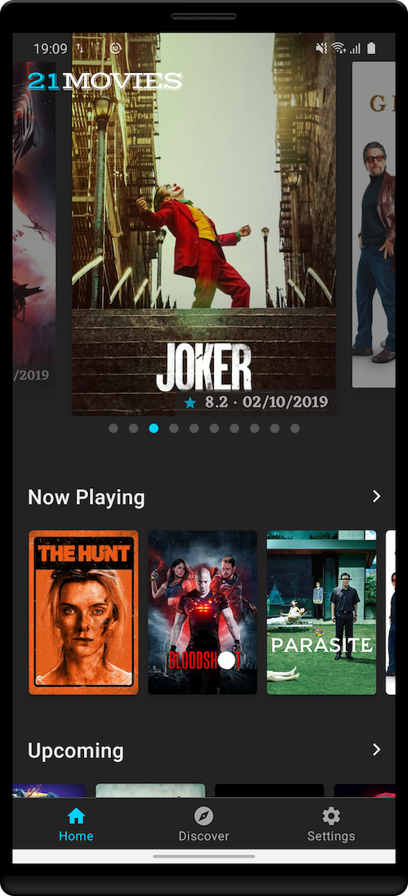
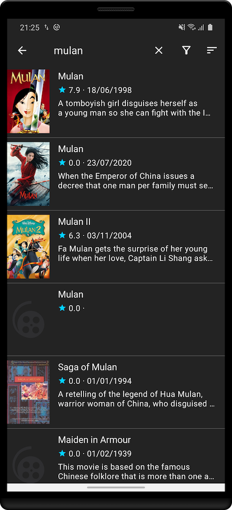

# The 21 Movies App

  


<a href='https://play.google.com/store/apps/details?id=me.li2.movies'></a>

This App is build on **Android Architecture Components (MVVM)** in **Kotlin**, contains the following features:

- Search Movies.
- Discover movies list by categories (trending, now playing, upcoming, popular, top rated) and genres (adventure, fantasy, animation, etc.), also support filter and sort.
- Watchlist (locally database supports).
- Movie detail, trailers, cast, crew, reviews, recommendations, etc.
- Firebase Cloud Messaging.
- Firebase Crashlytics.
- Offline supports in a few pages.
- Day and night theme.

All movies data and images are from [The Movie Database (TMDb](https://www.themoviedb.org/documentation/api)) API but is not endorsed or certified by it.


## Architecture

- **MVVM**:
  
    App is highly rely on Android Architecture Components, `ViewModel` is used to fetch data from `Repository` and to expose data as well as status (loading, success, error) to UI through `LiveData`, `Fragment` observers on the LiveData then render UI through `DataBinding`.
    
- **Remote Data Source**: Retrofit + Moshi(Json) + Coroutine

    to consume back-end services data.
    
- **Local Data Source** : Room

    to support view some content offline.

- **Navigation**:

    Navigation graph, controller, safe arguments and auto generated directions classes are used to navigate between screens as well as passing data to screens, also support container explode animation from list to detail page.
    
    
- **Dependency Injection**:

    use [Kodein-DI](https://github.com/Kodein-Framework/Kodein-DI) for DI because it's easy to set up and use.

- **UI**
  
    UIs are built on AndroidX and material components, support day and night theme, can also be changed to a new theme easily.


## Screenshots

| Home Page                                                               | Movies Page                                                   | Movie Detail Page                                                | Movie Detail Page 2                                                |
|-------------------------------------------------------------------------|---------------------------------------------------------------|------------------------------------------------------------------|--------------------------------------------------------------------|
|                 |     |  |  |
| **Discover Page**                                                       | **Settings Page**                                             | **Dependencies Page**                                            | **Movies Empty**                                                   |
|             |   |  |         |
| **Push Notification**                                                   | **Shimmer Loading Effect**                                    | **Movies Filter**                                                | **Movies Sort**                                                    |
|  |  |      |          |


## Code Highlight

### NetworkBoundResource
A generic class provides a resource backed by both the database and the network.

```kotlin
suspend fun getMovieDetail(movieId: Int, result: MutableLiveData<Resource<MovieDetailUI>>) {
    val cacheKey = "getMovieDetail:$movieId"
    object : NetworkBoundResource<MovieDetailUI>(result) {
        override suspend fun loadFromDb(): MovieDetailUI? {
            return localDataSource.getMovieDetail(movieId)
        }
        override fun shouldFetch(data: MovieDetailUI?): Boolean {
            return data == null || tmdbApiRateLimit.shouldFetch(cacheKey)
        }
        override suspend fun fetch(): MovieDetailUI {
            val apiResponse = tmdbDataSource.getMovieDetailAsync(movieId).await()
            return MapperUI.toMovieDetailUI(apiResponse)
        }
        override suspend fun saveFetchResult(data: MovieDetailUI) {
            localDataSource.saveMovieDetail(data)
        }
        override fun onFetchFailed() {
            tmdbApiRateLimit.reset(cacheKey)
        }
    }.load()
}
```

### Mapper
Convert back-end services data to data which makes sense for UIs. What it typically does is format numbers, data-time formating, compose an image url from host and path.

### RxBinding

UI click events are most handled by RxBinding, something like this:

```kotlin
compositeDisposable += Observable.merge(
        binding.searchInputLayout.endIconClicks(),
        binding.searchEditText.editorActionEvents().flatMap {
            if (it.actionId == IME_ACTION_SEARCH) Observable.just(Unit) else Observable.empty()
        }
).subscribe {
    // the search icon in the TextInputLayout clicked, or the search action in the IME keyboard clicked
}
```


### RecyclerView with paging / loading more state

Use `MergeAdapter` to merge a list and a loading state footer.

> MergeAdapter is a new class available in recyclerview:1.2.0-alpha02 which enables you to sequentially combine multiple adapters to be displayed in a single RecyclerView. This enables you to better encapsulate your adapters rather than having to combine many data sources into a single adapter, keeping them focused and re-usable.


```kotlin
/** An observable which emits value when RecyclerView was scrolled to bottom. */
fun RecyclerView.onScrolledBottom(): Observable<Unit>

binding.moviesRecyclerView.onScrolledBottom()
        // avoid duplicate API calls
        .throttleFirst(500, TimeUnit.MILLISECONDS)
        .subscribe {
            // don't load next page if it's in requesting, or error, or already on the last page.
            if (viewModel.canLoadMoreGenreMovies) {
                viewModel.searchGenreMovies(args.genre)
            }
        }
```

### RecyclerView with multiple view type

Two main points,
1st, override `getItemViewType` to tell the Adapter the view type, then Adapter is able to create different ViewHolders for each view type.

2nd, the movie detail page shows movie detail (title, overview, release date, vote, genres), trailer, credits, reviews, recomendations, those data come from 4 different API calls, which means we need to observe 4 LiveData, we can combine those LiveData together, just like Rx `combineLatest` function.

```kotlin
// MovieDetailViewModel.kt
internal var movieDetailRows: MediatorLiveData<List<BaseRowData>>
init {
    movieDetailRows = combineLatest(movieDetail, movieTrailer, movieReviews, recommendations) { results ->
        // process results emitted by thoses LiveData
        listOf(xxx)
    }
}

// MovieDetailFragment.kt
observeOnView(movieDetailRows) {
    detailAdapter.submitList(it)
}
```

`combineLatest`  emits an item whenever any of the source Observables emits an item, so long as each of the source Observables has emitted at least one item.
`obserOnView` is an extension function:

```kotlin
fun <R> combineLatest(vararg sources: LiveData<*>, onChange: (results: List<Any>) -> R): MediatorLiveData<R>

fun <T : Any, L : LiveData<T>> Fragment.observeOnView(liveData: L, body: (T) -> Unit) {
    liveData.observe(viewLifecycleOwner, Observer(body))
}
```

### ViewPager2 Auto-scroll & Carousel Effect

Having the individual components store their own logic to react to changes of lifecycle status makes the fragment logic easier to manage.

```kotlin
/** A lifecycle awareness interface serve as a plugin to provide the ViewPager auto scroll ability. */
interface ViewPager2AutoScrollHelper : LifecycleObserver
/**
 * Provide carousel scroll ability for RecyclerView [ListAdapter] by mocking up
 * the limited dataset with [Int.MAX_VALUE].
 */
interface CarouselPagerHelper
```

### Keep Fragment View State within Navigation Graph

Fragment view will be destroyed / recreated within Jetpack's Android Navigation components when user navigate back and forth. see [question](https://stackoverflow.com/a/55039009/2722270)

Although your data was stored in ViewModel and the Fragment view can be reconstructed in one second, the screen will flicker, especially for a complex screen contains nested vertical scroll widgets and  horizontal scroll widgets.  To provide the user a better UI experience, we can:

- load data in your ViewModel's init {} or Fragment's onCreate(), not in onViewCreated().
- store the view in a variable and instead of inflating a new layout, just return the instance of pre-stored view on onCreateView()


## CI/CD

CI/CD using GitHub Actions, I added 3 workflows:

- **Development workflow**

    triggered on every new code commits on feature branches, jobs include junit test.
- **UAT release workflow**

    triggered on pushing commits or pull request to master (main trunk), jobs include junit test, deploy signed APK to Firebase App Distribution.
- **Production release workflow**

    triggered on Github tags created, jobs include: junit test, automatically bump version code (simply +1) and version name (from tag), deploy signed App bundle file(.aab) to PlayStore.

Also support fastlane with 3 main lanes:

- **test**

- **uatRelease**: use `firebase_app_distribution` to deploy signed APK to Firebase App Distribution.

- **productionRelease**: use `supply` to deploy signed App bundle file(.aab) to PlayStore. 

    KNOWN ISSUE: [fastlane #16593: Google Api Error: Invalid request - Access Not Configured](https://github.com/fastlane/fastlane/issues/16593)

Read more: https://github.com/li2/hello_fastlane


## Build on your own

Add your TMDB API key in resource:
```xml
<string name="tmdb_api_key" translatable="false">@string/your_private_tmdb_api_key</string>
```


## Refers

- [TMDB API Docs](https://developers.themoviedb.org/3/getting-started/introduction)
- [Guide To App Architecture](https://developer.android.com/jetpack/docs/guide)
- [GitHub: googlecodelabs/android-paging](https://github.com/googlecodelabs/android-paging)
- [LiveData beyond the ViewModel — Reactive patterns using Transformations and MediatorLiveData](https://medium.com/androiddevelopers/livedata-beyond-the-viewmodel-reactive-patterns-using-transformations-and-mediatorlivedata-fda520ba00b7)
- [Merge adapters sequentially with MergeAdapter](https://medium.com/androiddevelopers/merge-adapters-sequentially-with-mergeadapter-294d2942127a)
- [NetworkBoundResource:  load data from the network while showing the disk copy of that data](https://developer.android.com/jetpack/docs/guide#addendum)


## Dependencies

framework
- https://developer.android.com/jetpack/androidx
- https://developer.android.com/kotlin/ktx
- https://github.com/Kotlin/kotlinx.coroutines
- https://github.com/Kodein-Framework/Kodein-DI
- https://github.com/material-components/material-components-android

network
- https://square.github.io/retrofit/
- https://github.com/square/okhttp
- https://github.com/square/moshi
- https://firebase.google.com/docs/cloud-messaging

rx
- https://github.com/ReactiveX/RxAndroid
- https://github.com/ReactiveX/RxKotlin
- https://github.com/JakeWharton/RxBinding

debbug
- https://firebase.google.com/docs/crashlytics
- https://github.com/JakeWharton/timber
- https://github.com/square/okhttp/tree/master/okhttp-logging-interceptor
- https://github.com/jgilfelt/chuck
- https://github.com/amitshekhariitbhu/Android-Debug-Database

3rd view libs
- https://bumptech.github.io/glide
- https://github.com/romandanylyk/PageIndicatorView
- http://facebook.github.io/shimmer-android
- https://github.com/chrisbanes/PhotoView
- https://github.com/Jay-Goo/RangeSeekBar
- https://jitpack.io/p/omegaes/android-link-previe


## License

```
    Copyright (C) 2020 Weiyi Li

    Licensed under the Apache License, Version 2.0 (the "License");
    you may not use this file except in compliance with the License.
    You may obtain a copy of the License at

       http://www.apache.org/licenses/LICENSE-2.0

    Unless required by applicable law or agreed to in writing, software
    distributed under the License is distributed on an "AS IS" BASIS,
    WITHOUT WARRANTIES OR CONDITIONS OF ANY KIND, either express or implied.
    See the License for the specific language governing permissions and
    limitations under the License.
```

Weiyi Li
2020-06-07