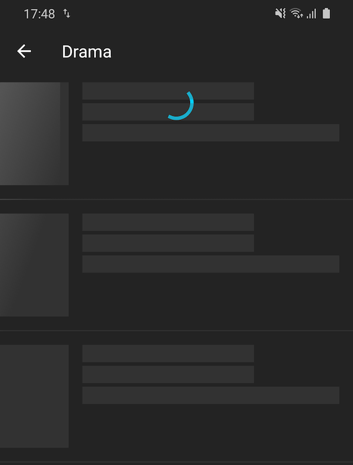

# The 21 Movies App

This App is build on **Android Architecture Components (MVVM)** in **Kotlin** with following UI features:

| Home Page                                                | Movies Page                                                | Movie Detail Page                                                |
|----------------------------------------------------------|------------------------------------------------------------|------------------------------------------------------------------|
|  |  |  |


## Architecture

- **MVVM**:

    `ViewModel` is used to fetch data from `Repository` and to expose data as well as status (loading, success, error) to UI through `LiveData`, `Fragment` observers on the LiveData to render UI through `DataBinding`.
    
- **Retrofit + Moshi(Json) + Coroutine**:

    to consume back-end services data.

- **Navigation**:

    Navigation graph, controller, safe arguments and auto generated directions classes are used to navigate between screens as well as passing data to screens.
    
    
- **Dependency Injection**:

    use [Kodein-DI](https://github.com/Kodein-Framework/Kodein-DI) for DI because it's easy to set up and use.


## Features

### NetworkBoundResource
A generic class provides a resource backed by both the database and the network.

```kotlin
suspend fun getMovieDetail(movieId: Int, result: MutableLiveData<Resource<MovieDetailUI>>) {
    val cacheKey = "getMovieDetail:$movieId"
    object : NetworkBoundResource<MovieDetailUI>(result) {
        override suspend fun loadFromDb(): MovieDetailUI? {
            return localDataSource.getMovieDetail(movieId)
        }

        override fun shouldFetch(data: MovieDetailUI?): Boolean {
            return data == null || tmdbApiRateLimit.shouldFetch(cacheKey)
        }

        override suspend fun fetch(): MovieDetailUI {
            val apiResponse = tmdbDataSource.getMovieDetailAsync(movieId).await()
            return MapperUI.toMovieDetailUI(apiResponse)
        }

        override suspend fun saveFetchResult(data: MovieDetailUI) {
            localDataSource.saveMovieDetail(data)
        }

        override fun onFetchFailed() {
            tmdbApiRateLimit.reset(cacheKey)
        }
    }.load()
}
```

### Mapper
Convert back-end services data to data which makes sense for UIs. What it typically does is format numbers, data-time formating, compose a image url from host and path.

### RecyclerView Loading More

Use `MergeAdapter` to merge a list and a loading state footer.

> MergeAdapter is a new class available in recyclerview:1.2.0-alpha02 which enables you to sequentially combine multiple adapters to be displayed in a single RecyclerView. This enables you to better encapsulate your adapters rather than having to combine many data sources into a single adapter, keeping them focused and re-usable.


```kotlin
/** An observable which emits value when RecyclerView was scrolled to bottom. */
fun RecyclerView.onScrolledBottom(): Observable<Unit>

binding.moviesRecyclerView.onScrolledBottom()
        // avoid duplicate API calls
        .throttleFirst(500, TimeUnit.MILLISECONDS)
        .subscribe {
            // don't load next page if it's in requesting, or error, or already on the last page.
            if (viewModel.canLoadMoreGenreMovies) {
                viewModel.searchGenreMovies(args.genre)
            }
        }
```

### RecyclerView with multiple view type

Two main points,
1st, override `getItemViewType` to tell the Adapter the view type, then Adapter is able to create different ViewHolders for each view type.

2nd, the movie detail page shows movie title, overview, release date, vote, trailer, genres, reviews, recomendations, those data come from 4 different API calls, which means we need to ovserve 4 LiveData, we can combine those LiveData together, just like Rx `combineLatest` function.

```kotlin
// MovieDetailViewModel.kt
internal var movieDetailRows: MediatorLiveData<List<BaseRowData>>

init {
    movieDetailRows = combineLatest(movieDetail, movieTrailer, movieReviews, recommendations) { results ->
        // process results emitted by thoses LiveData
        listOf(DetailRowData(movieDetail = xxx),
                ReviewsRowData(reviews = xxx),
                RecMoviesRowData(movies = xxx))
    }
}

// MovieDetailFragment.kt
observeOnView(movieDetailRows) {
    detailAdapter.submitList(it)
}
```

`obserOnView` is an extension function:

```kotlin
fun <T : Any, L : LiveData<T>> Fragment.observeOnView(liveData: L, body: (T) -> Unit) {
    liveData.observe(viewLifecycleOwner, Observer(body))
}
```

### ViewPager2 Auto-scroll & Carousel Effect

```kotlin
/**
 * A lifecycle awareness interface serve as a plugin to provide the ViewPager auto scroll ability.
 *
 * - Added LifecycleObserver to make this interface to be self-sufficient.
 * - Having the individual components store their own logic to react to changes in lifecycle status
 *      makes the fragment logic easier to manage.
 */
interface ViewPager2AutoScrollHelper : LifecycleObserver

/**
 * Provide carousel scroll ability for RecyclerView [ListAdapter] by mocking up
 * the limited dataset with [Int.MAX_VALUE].
 *
 *    class YourListAdapter : ListAdapter<Item, ItemViewHolder>(DIFF_CALLBACK), CarouselPagerHelper {
 *        override val carouselDatasetSize: Int
 *            get() = currentList.size
 *        override fun onBindViewHolder(viewHolder: TopItemViewHolder, position: Int) {
 *            val dataPosition = getCarouselDataPosition(position)
 *            viewHolder.bind(getItem(dataPosition))
 *        }
 *        override fun getItemCount() = getCarouselDisplaySize()
 *    }
 */
interface CarouselPagerHelper
```

### Keep Fragment View State within Navigation Graph

Fragment view will be destroyed / recreated with Jetpack's Android Navigation components when user left the page and then navigate back. see [question](https://stackoverflow.com/a/55039009/2722270)

Although your data was stored in ViewModel and the Fragment view can be reconstructed in a second, the screen will flicker, especially for a complex screen contains nested vertical scroll widgets and  horizontal scroll widgets.  Solution:

- load data in your ViewModel's init {} or Fragment's onCreate(), not in onViewCreated().
- store the view in a variable and instead of inflating a new layout, just return the instance of pre-stored view on onCreateView()


### Shimmer Loading Effect




### Firebase Cloud Messages


## Refers

- [TMDB API Docs](https://developers.themoviedb.org/3/getting-started/introduction)
- [Guide To App Architecture](https://developer.android.com/jetpack/docs/guide)
- [GitHub: googlecodelabs/android-paging](https://github.com/googlecodelabs/android-paging)
- [LiveData beyond the ViewModel — Reactive patterns using Transformations and MediatorLiveData](https://medium.com/androiddevelopers/livedata-beyond-the-viewmodel-reactive-patterns-using-transformations-and-mediatorlivedata-fda520ba00b7)
- [Merge adapters sequentially with MergeAdapter](https://medium.com/androiddevelopers/merge-adapters-sequentially-with-mergeadapter-294d2942127a)
- [NetworkBoundResource:  load data from the network while showing the disk copy of that data](https://developer.android.com/jetpack/docs/guide#addendum)

Weiyi Li
2020-05-16